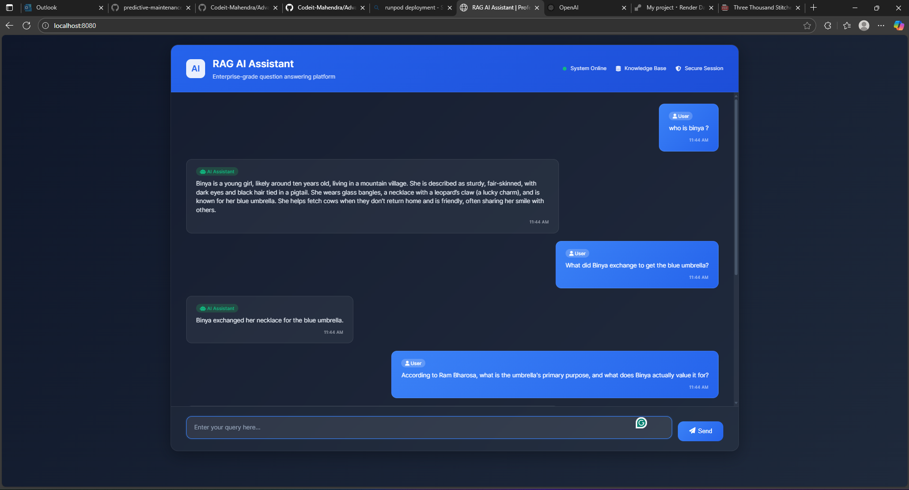

# Advanced QnA RAG System

A sophisticated Retrieval-Augmented Generation (RAG) system built for question-answering tasks, specifically implemented to analyze and answer questions about literary content.



## 🎯 Sample Questions to Test

### Character-Based Questions
- **What did Binya exchange to get the blue umbrella?**
- **Who is Binya?**
- **Who is Bijju?**

### Plot and Setting Questions
- **Tell me about Ram's shop?**
- **How did the wind cause Binya's umbrella to end up in danger?**
- **Where did this Silver pendant come from?**

### Analytical Questions
- **Why did Ram Bharosa make an offer to buy the umbrella, and what does his final reaction suggest about his feelings towards it?**
- **According to Ram Bharosa, what is the umbrella's primary purpose, and what does Binya actually value it for?**

### General Questions
- **Who is the author of this book?**
- **Who gives Binya that pendant?** But Tricky too

### Trick Questions
- **Who is Sharukh Khan?**


## 📁 Project Structure

```
Advanced-QNA-RAG/
├── .env                          # Environment variables
├── .gitignore                    # Git ignore rules
├── LICENSE                       # Project license
├── README.md                     # Project documentation
├── app.py                        # Main FastAPI application
├── requirements.txt              # Python dependencies
├── setup.py                      # Package configuration
├── render.yaml                   # Deployment configuration  #for Render based Deployment
├── image.png                     # Project screenshot
├── store_index.py                # Script to store embeddings
├── template.py                   # Template utilities
├── folder_structure.py           # Directory structure generator
├── __pycache__/                  # Python cache
│   └── app.cpython-310.pyc
├── data/                         # Data directory
│   └── Three Thousand Stitches by Sudha Murthy.pdf
├── research/                     # Research and development
│   └── trials.ipynb             # Jupyter notebook experiments
├── src/                         # Source code
│   ├── __init__.py
│   ├── helper.py                # Embedding and utility functions
│   ├── prompt.py                # System prompts and templates
│   └── __pycache__/             # Python cache
├── static/                      # Static files
│   └── chat.html               # Web interface
└── advanced_qna_rag.egg-info/  # Package metadata
    ├── PKG-INFO
    ├── SOURCES.txt
    ├── dependency_links.txt
    └── top_level.txt
```

## 📖 Project Overview

This project implements an advanced RAG pipeline that can answer detailed questions about textual content. The current implementation is configured to analyze literary works, providing accurate, context-aware responses to user queries.

## 🚀 Features

- **Advanced Retrieval**: Uses Pinecone vector database for efficient semantic search
- **Groq Integration**: Leverages high-performance LLMs via Groq API
- **FastAPI Backend**: Robust and scalable web API
- **Clean UI**: Simple and intuitive chat interface
- **Context-Aware Responses**: Provides answers based strictly on provided context
- **Response Cleaning**: Advanced post-processing to remove internal model reasoning
- **Research Notebooks**: Comprehensive experimentation and testing

## 🛠️ Technology Stack

- **Backend**: FastAPI, Python
- **Vector Database**: Pinecone
- **LLM**: Groq API (Qwen3-32B model)
- **Embeddings**: Sentence Transformers
- **Frontend**: HTML
- **Environment**: dotenv for configuration
- **Deployment**: Render configuration included

## 📋 Setup Instructions

### Prerequisites

- Python 3.10+
- Pinecone API key
- Groq API key

### Installation

1. **Clone the repository**
   ```bash
   git clone https://github.com/Codeit-Mahendra/Advanced-QNA-RAG.git
   cd Advanced-QNA-RAG
   ```

2. **Install dependencies**
   ```bash
   pip install -r requirements.txt
   ```

3. **Set up environment variables**
   Create a `.env` file in the root directory:
   ```env
   PINECONE_API_KEY=your_pinecone_api_key_here
   GROQ_API_KEY=your_groq_api_key_here
   ```

4. **Configure Pinecone Index**
   - Ensure you have a Pinecone index named `advanced-qna-rag`
   - Use `store_index.py` to populate the index with your documents

5. **Run the application**
   ```bash
   python app.py
   ```

6. **Access the application**
   Open your browser and navigate to `http://localhost:8080`


## 🔧 Key Components

### Core Application Files

- **`app.py`** - Main FastAPI application with RAG chain implementation
- **`store_index.py`** - Script for storing document embeddings in Pinecone
- **`src/helper.py`** - Embedding download and utility functions
- **`src/prompt.py`** - System prompts and conversation templates

### Configuration Files

- **`requirements.txt`** - Python package dependencies
- **`render.yaml`** - Deployment configuration for Render
- **`setup.py`** - Package setup and distribution configuration

### Research & Development

- **`research/trials.ipynb`** - Jupyter notebook for experimentation
- **`data/`** - Directory containing source documents (PDFs)

## 🎮 Usage

1. **Start the application** using `python app.py`
2. **Open the web interface** at `http://localhost:8080`
3. **Type your question** in the input field
4. **Receive context-aware answers** based on the stored knowledge

## 🔍 How It Works

1. **Document Processing**: PDFs are chunked and embedded using sentence transformers
2. **Vector Storage**: Embeddings are stored in Pinecone vector database
3. **Query Processing**: User questions are converted to embeddings
4. **Semantic Search**: Similar chunks are retrieved from Pinecone (k=5)
5. **Context Augmentation**: Retrieved context is combined with the question
6. **LLM Generation**: Groq model generates answers based on augmented prompt
7. **Response Cleaning**: Internal reasoning tags are removed before display

## ⚙️ Configuration

### Model Settings
- **Model**: `qwen/qwen3-32b`
- **Temperature**: 0.3
- **Search Type**: Similarity
- **Top K**: 5 documents

### Vector Store
- **Index**: `advanced-qna-rag`
- **Embeddings**: Sentence transformers

## 🚀 Deployment

The project includes `render.yaml` for easy deployment on Render.com. Update the environment variables in your Render dashboard:

- `PINECONE_API_KEY`
- `GROQ_API_KEY`

## 🤝 Contributing

1. Fork the repository
2. Create a feature branch (`git checkout -b feature/amazing-feature`)
3. Commit your changes (`git commit -m 'Add amazing feature'`)
4. Push to the branch (`git push origin feature/amazing-feature`)
5. Open a Pull Request

## 📄 License

This project is licensed under the MIT License - see the [LICENSE](LICENSE) file for details.

## 🙏 Acknowledgments

- Groq for high-performance LLM inference
- Pinecone for vector database services
- LangChain for the RAG framework
- FastAPI for the web framework

---

**Note**: Make sure to set up your API keys in the `.env` file before running the application. The system can be adapted for different texts by updating the Pinecone index with new documents.